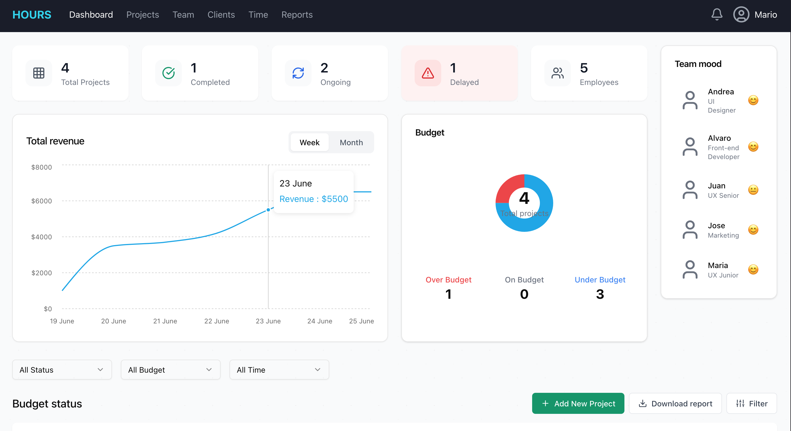
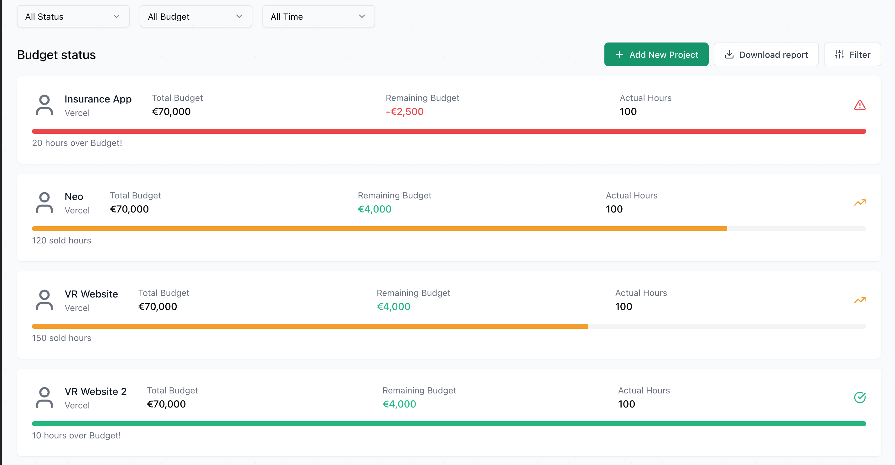

# Project Manager's Dashboard

## Project Overview

A sophisticated frontend dashboard application for project management, developed as part of the ROC-8 Frontend Assignment. The dashboard provides a comprehensive view of project statuses, team performance, revenue, and budget tracking.

## 🚀 Features

- Interactive project overview
- Real-time budget and revenue tracking
- Team mood and performance visualization
- Responsive and accessible design
- Smooth, performant animations
- Modular and scalable component architecture

## 🛠 Technology Stack

### Core Technologies
- **React + TypeScript**: Robust, type-safe frontend development
- **Vite**: Lightning-fast build tool and development server
- **Tailwind CSS**: Utility-first CSS framework for rapid UI development
- **shadcn/ui**: Beautifully designed, accessible component library

### Additional Technologies
- **CSS Modules**: Scoped styling for component-level encapsulation
- **Framer Motion**: Declarative animations and interactions
- **Lucide React**: Elegant, consistent icon system
- **Recharts**: Composable charting library

### Development Tools
- **Jest**: Comprehensive testing framework
- **Husky**: Git hooks for improved workflow
- **Commit-lint**: Enforcing consistent commit message standards
- **ESLint**: Static code analysis and error prevention
- **Prettier**: Consistent code formatting

### Architecture
- **Atomic Design**: Modular component organization
  - Atoms: Basic building blocks
  - Molecules: Simple component compositions
  - Organisms: Complex, interconnected components
  - Templates: Page-level layouts
  - Pages: Complete screen implementations

## 📸 Screenshots



## 🗂 Project Structure

```
src/
├── components/
│   ├── atoms/        # Smallest, indivisible components
│   ├── molecules/    # Simple component groups
│   ├── organisms/    # Complex, domain-specific components
│   ├── templates/    # Page layout components
│   └── ui/           # Shadcn UI and reusable components
├── hooks/            # Custom React hooks
├── lib/              # Utility functions and services
│   ├── mock-data.ts  # Simulated backend data
│   └── utils.ts      # Shared utility functions
├── types/            # TypeScript type definitions
├── styles/           # Global CSS and CSS Module definitions
└── app/              # Main application components
```

## 🚦 Getting Started

### Prerequisites

- Node.js (v18+)
- Yarn or npm
- Git

### Installation & Setup

1. Clone the repository
```bash
git clone https://github.com/Prathmesh-Dhatrak/roc-8-assignment.git
cd roc-8-assignment
```

2. Install dependencies
```bash
yarn install
```

3. Run development server
```bash
yarn dev
```

4. Build for production
```bash
yarn build
```

## 🧪 Development Scripts

- `yarn dev`: Start development server
- `yarn build`: Create production build
- `yarn test`: Run Jest test suite
- `yarn lint`: Run ESLint
- `yarn format`: Format code with Prettier

## 🔍 Testing

Comprehensive test coverage using Jest:
- Unit tests for components
- Hook testing
- Snapshot testing
- Mock data validation

```bash
yarn test
# Run with coverage
yarn test:coverage
```

## 📋 Key Components

- **StatisticCard**: Modular project statistics display
- **RevenueChart**: Interactive revenue trend visualization
- **BudgetChart**: Circular budget status representation
- **TeamSection**: Dynamic team performance insights
- **ProjectList**: Comprehensive project detail exploration


### Commit Message Convention
- `feat:` for new features
- `fix:` for bug fixes
- `docs:` for documentation updates
- `style:` for formatting changes
- `refactor:` for code restructuring
- `test:` for test-related changes
